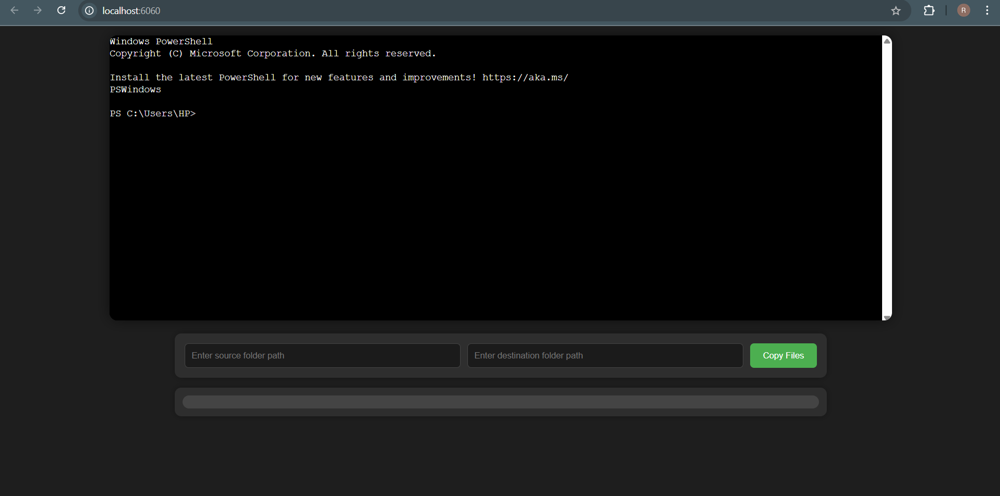

# 🧭 web-based command line emulator

A real-time, cross-platform web terminal with file copy support, built using Node.js, WebSockets, and `node-pty`. This server allows users to interact with a shell via a web UI and copy files/folders between paths through the browser.

---

## ✨ Features

- Web-based terminal UI using `xterm.js`
- Real-time shell interaction via WebSockets
- Cross-platform file copy support:
  - Windows: Uses `robocopy`
  - Linux/macOS: Uses `cp`
- Shared or individual terminal sessions
- Displays executed shell commands in UI for transparency and debugging
- Built-in static file server for frontend assets
- Clean and minimal user experience

---

## 📦 Prerequisites

Ensure the following are installed on your system:

- [Node.js](https://nodejs.org/) v16 or higher
- npm (comes with Node.js)
- Unix shell or PowerShell depending on your OS
- visual studio 2022 developement tools with c++
---

## ⚙️ Installation

### 1. Clone the Repository

```bash
git clone https://github.com/ronakbediya310/web-based-terminal-emulator.git
cd interactive-terminal
```

## 2. Install Dependencies
- Go to: https://visualstudio.microsoft.com/visual-cpp-build-tools/
- Download and install Build Tools for Visual Studio 2022
- During installation, select "Desktop development with C++"
- This is essential for native module compilation like node-pty
```bash
set msvs_version=2022
npm install
```

## 3. Run the Server
```bash
npm run start
```
- The server will be available at:
- http://localhost:6060

## 4. 🧰 Built With
- Node.js
- xterm.js
- ws (WebSocket library)
- node-pty (shell integration)

## 5.📷 Screenshot
